# Modernize Your Migrated virtual machine using Azure Web Apps, Azure Container Registry, Azure CosmosDB and Docker

## Expected Outcome

This challenge provides a path to modernize the application running on the virtual machine which was migrated in the "CloudEndure Challenge 3" exercise.

Inside the "migrate-host" virtual machine on your Linux desktop, there is a NodeJS application running and exposed on port 80. It connects to a locally running instance of MongoDB on "migrate-host" to store its data.

As part of this challenge, you will take the front-end NodeJS application and containerize it using Docker; You will then upload the container to Azure Container Registry.  For the back-end database, we will export the MongoDB data which has been entered into the NodeJS WebUI and import it into Azure CosmosDB. Finally the container which was uploaded to Azure Container Registry will be configured as an Azure Web App and deployed using Azure's PaaS capabilities. 

At the end of the challenge, you should have the front-end NodeJS application running as a container inside Azure Web Apps, and the back-end database running in CosmosDB thus removing the need for the virtual machine to exist. This modernization effort is a valid next step in cloud transformation and adoption as workloads are abstracted and migrated to PaaS offerings.

## Process

1. <strong>Access the running NodeJS application on the source "migrate-host" virtual machine</strong>

    * Determine the IP address of the source "migrate-host" virtual machine; This is found in a text file on your Linux desktop.

    * Open a new FireFox web browser from within the Linux Desktop

    * Access the NodeJS application by visiting ```http://<SOURCE-VM-IP-ADDRESS>```

      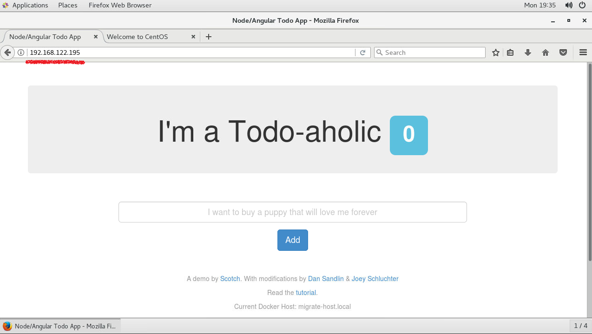

<hr>

2. <strong>Populate the local MongoDB with data using the NodeJS application</strong>

   * Add some content to the MongoDB using the NodeJS application by entering information in the submit box and clicking the "Add" button

   * Feel free to add as many/few lines of data into the database as you see fit

      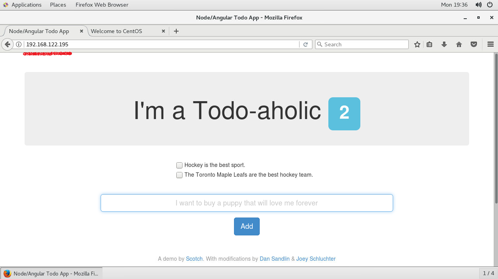  

<hr>

3. <strong>Perform another virtual machine test with CloudEndure</strong>

    * Return back to the CloudEndure Console

    * Select the checkbox next to the "migrate-host" virtual machine, Click "Launch Target Machines" and select "Test".  This will cause a new virtual machine instance to be created within Azure based on the current status of your source virtual machine.  Since you have "updated" it by providing data to the NodeJS application / MongoDB environment, this should now also migrate to Microsoft Azure.

    * After the test is completed, this should reflect in the "Machines" tab

      

<hr>

4. <strong>Wait for the virtual machine test migration to complete</strong>

   * Ensure that the virtual machine test migration has completed from Step 3 <strong>&lt;--IMPORTANT</strong>

<hr>

5. <strong>Verify that the NodeJS application is running in the virtual machine you migrated to Azure</strong>

   * Determine the IP address of the newly tested virtual machine by visiting the "Target" tab in the CloudEndure console

   * Verify that the NodeJS application is still available on the migrated host which now exists in Azure and contains all of the data you've published to it.  Visit ```http://<MIGRATED-IP-ADDRESS>``` (this may take a few moments to become live after the virtual machine is started)

      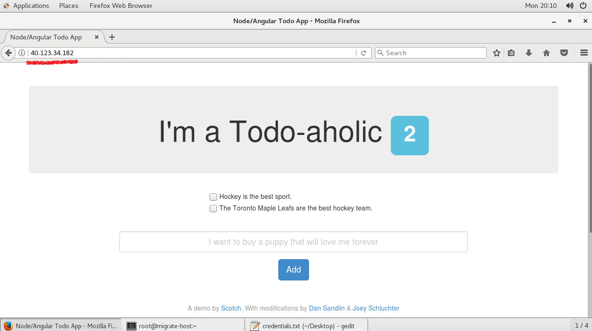

<hr>

6. <strong>Add additional content to the MongoDB using the NodsJS application</strong>


   * Now that the host has been migrated to Azure, add some additional content to the MongoDB using the NodeJS application by entering information in the submit box and clicking the "Add" button

   * Be sure to perform this action on the <strong>NEWLY MIGRATED VIRTUAL MACHINE</strong> which you just viewed and <STRONG>NOT</STRONG> the source virtual machine (192.168.122.x). At this point, we will no longer make use of the <strong>source</strong> "migrate-host" virtual machine running inside your Linux desktop that you just migrated.

      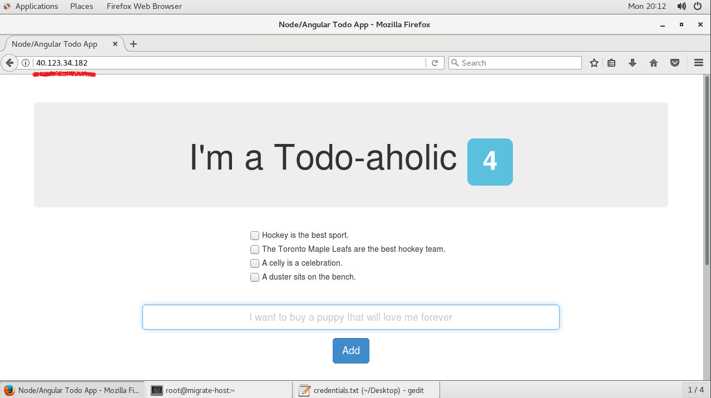

<hr>

7. <strong>Containerize the NodeJS Application</strong>

   * Determine the IP Address of the migrated virtual machine running in Azure and SSH to it:  ```ssh root@your.azure.ip.address```

   * Ensure the <strong>"docker"</strong> RPM is installed on your migrate-host virtual machine.  If it isn't, install it:  ```yum -y install docker```

   * Ensure that <strong>"docker"</strong> is configured to start by systemd and that it is, in fact, started:  ```systemctl enable docker ; systemctl start docker```

   * Navigate to the NodeJS application's root directory: ```cd /source/sample-apps/nodejs-todo/src```

   * Edit the "<strong>Dockerfile"</strong> configuration file and change the port to be exposed from port 8080 to port 80 when the container is executed:  ```vi Dockerfile```

   * Edit the "<strong>/etc/mongod.conf"</strong> configuration file and comment out the <strong>"bindIp"</strong> directive which will force MongoDB to listen on all interfaces:  ```vi /etc/mongod.conf```

   * Restart mongod using systemctl:  ```systemctl restart mongod```

   * From within the NodeJS application's root directory, containerize the application:  ```docker build -t ossdemo/nodejs-todo .```

   * Verify that the container was indeed created:  ```docker images```

   * Shutdown and disable the locally running NodsJS application:  ```systemctl stop pm2-root ; systemctl disable pm2-root```
 
   * Verify in your browser that the NodeJS application in Azure is no longer reachable and produces an error when you try to access it

      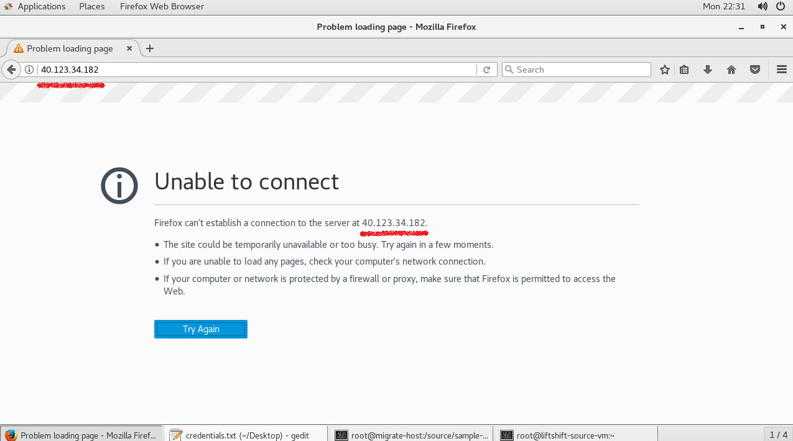

<hr>

8. <strong>Test the Local Container</strong>


   * Run the newly created container locally to test it:  ```docker run -d -e MONGO_DBCONNECTION=mongodb://172.17.0.1:27017/nodejs-todo -p 80:80 --name=nodejs-todo ossdemo/nodejs-todo```

      

   * Using your Firefox browser on your Linux desktop, navigate to ```http://<MIGRATED-IP-ADDRESS>``` to verify the NodeJS application is once again running on the newly-migrated Azure virtual machine. It is now running inside of a Docker container on the virtual machine you've migrated to Azure, however it is still making use of the local MongoDB for its data.

   * Feel free to add additional content if you wish.

      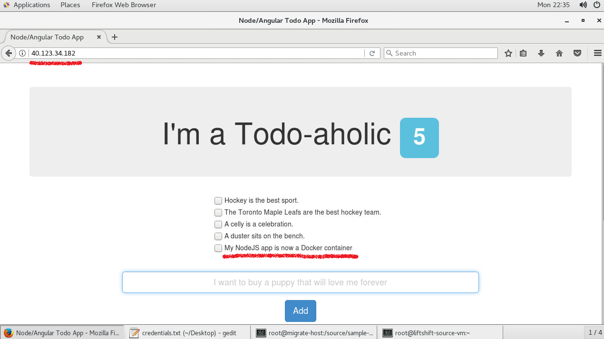

<hr>

9. <strong>Create and Utilize Azure Container Registry</strong>

   * Using the Azure Linux CLI, create an Azure Container Registry:
       * Use the -n switch to give it a unique name, ex: <strong>firstnamelastnamebirthyear</strong>
       * Use the -g switch to specify the name of the resource group you have been assigned, ex: <STRONG>ODL-LIFTSHIFT-1234</STRONG>
       * Use the -l switch to specify the name of the Azure data center your resource group is in, ex: <strong>centralus</strong> or <strong>eastus</strong>

   * Create the registry: ```az acr create -n <ACR_NAME> -g <YOUR_RG> -l <YOUR_DC> --admin-enabled true --sku Basic```

      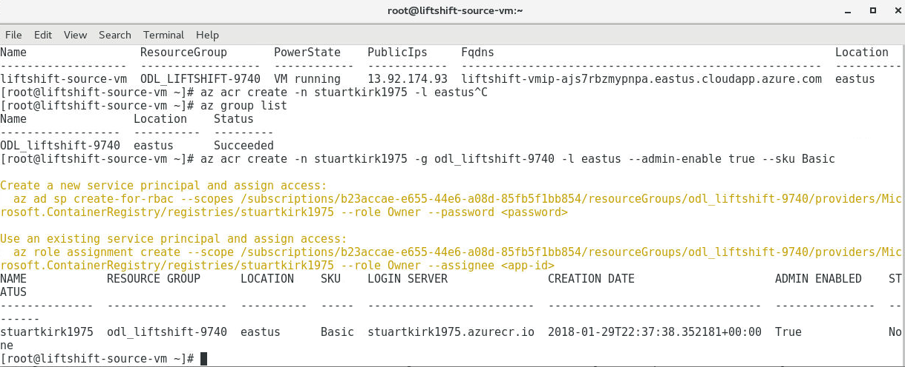

   * Determine the password which Azure has assigned to your ACR:  ```az acr credential show -n <ACR_NAME> --query passwords[0].value```

      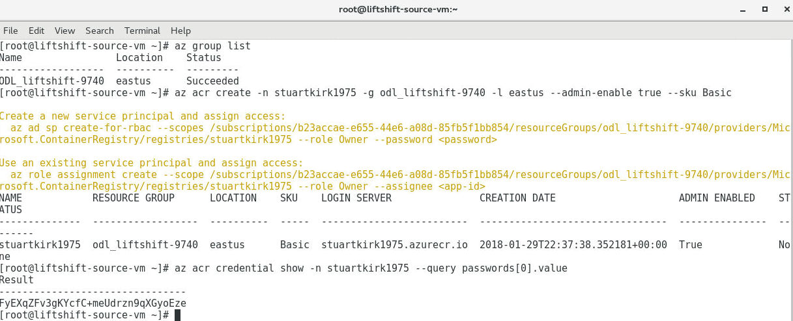

   * Returning back to the virtual machine which you've migrated to Azure, tag the docker image using the name you set for the ACR:  ```docker tag ossdemo/nodejs-todo <ACR_NAME>.azurecr.io/ossdemo/nodejs-todo```
 
   * Use docker to log in to your ACR using the password you just obtained from the previous step:  ```docker login <ACR_NAME>.azurecr.io -u <NAME> -p <PASSWORD>```

   * Push the container you have built and tested to the ACR:  ```docker push <ACR_NAME>.azurecr.io/ossdemo/nodejs-todo```

      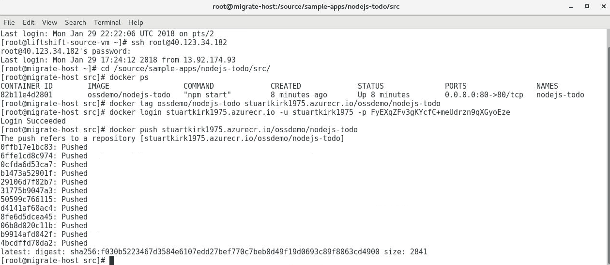

<hr>

10. <strong>Create a CosmosDB and Perform a MongoDB Migration</strong>

   * Using the Azure Linux CLI, create a MongoDB-based Azure CosmosDB:
       * Use the -n switch to give it a unique name, ex: <strong>firstnamelastname-cosmos</strong>
       * Use the --kind switch to specify a MongoDB database
       * Use the -g switch to specify the name of the resource group you have been assigned, ex: <STRONG>ODL-LIFTSHIFT-1234</STRONG>

   * Create the CosmosDB:  ```az cosmosdb create --name <COSMOS_NAME> --kind MongoDB -g <YOUR_RG>```

   * In order for the to-be-created Azure Web App to connect to this CosmosDB we will need to determine what the connection string variable will be. This will also provide the password we will use to connect to the database. Use the Azure Linux CLI to determine what this is:  ```az cosmosdb list-connection-strings -g <YOUR_RG> -n <COSMOS_NAME> --query connectionStrings[].connectionString```
 
   

   * Returning back to the virtual machine which you've migrated to Azure, export the data from your existing MongoDB to a JSON flat-file:  ```mongoexport --db nodejs-todo --collection todos --out todos.json```

To perform the CosmosDB import, the password you will need to enter is provided to you in the connection string you just obtained and is underlined in the example above. In this particular example, the password is: <strong>Vx1iXovK6BmllcQ9jG9VdhjOGEaslXsuXCoBcE3tZP4W49FJuQbh8EP3wWVQx2L1QM9ggMGNgzWuLE0Qhd0Zmw==</strong>

   * Import the data from the JSON flat-file to CosmosDB:  ```mongoimport -h <COSMOS_NAME>.documents.azure.com:10255 -u <COSMOS_NAME> -p <PASSWORD> --ssl --sslAllowInvalidCertificates -d admin -c todos --file=todos.json --type=json``` and look for output similar to this:

   

<hr>

11. <strong>Deploy the containerized NodeJS application as an Azure Web App</strong>

   * Using the Azure Linux CLI, create an Azure App Service Plan and associate it to your assigned resource group:
       * Use the -g switch to specify the name of the resource group you have been assigned, ex: <STRONG>ODL-LIFTSHIFT-1234</STRONG>
       * Use the -l switch to specify the name of the Azure data center your resource group is in, ex: <strong>centralus</strong> or <strong>eastus</strong>
       * The name of the webapp must be unique across Azure, as the FQDN for it is by default created using the name. When you create the webapp, use a unique name, ex: <strong>firstnamelastnamebirthyear</strong>

   * Create the App Service Plan: ```az appservice plan create -g <YOUR_RG> -n webtier-plan --is-linux --number-of-workers 1 --sku S1 -l <YOUR_DC>```

   

   * Create the Azure Web Application:  ```az webapp create -g <YOUR_RG> -p webtier-plan -n <WEBAPP_NAME> -i ossdemo/nodejs-todo```

   * Remind yourself of your ACR settings:  ```az acr list -g <YOUR_RG>```

   * Remind yourself of your ACR password:  ```az acr credential show -n <ACR_NAME> --query passwords[0].value```

   * Configure the Azure Web Application: ```az webapp config container set -g <YOUR_RG> -n <WEBAPP_NAME> -p <ACR_PASSWD> -r <ACR_NAME>.azurecr.io -u <ACR_NAME> -i <ACR_NAME>.azurecr.io/ossdemo/nodejs-todo```

   * Remind yourself of the CosmosDB Connection String:  ```az cosmosdb list-connection-strings -g <YOUR_RG> -n <COSMOS_NAME> --query connectionStrings[].connectionString```

   * Update the Azure Web App with the CosmosDB Connection String: ```az webapp config appsettings set -n <WEBAPP_NAME> -g <YOUR_RG> --settings MONGO_DBCONNECTION=<ENTIRE_OUTPUT_OF_MONGO_CONNECTION_STRING>```

      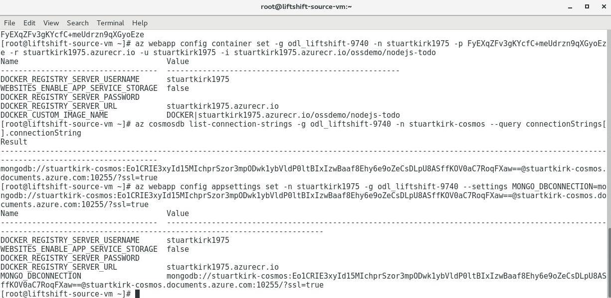

<hr>

12. <strong>Verify Application</strong>

The application will take a few minutes to update and become live.  When it does, you can connect to it at the URL:  [https://<WEBAPP_NAME>.azurewebsites.net](https://<WEBAPP_NAME>.azurewebsites.net).  Verify that the data which was exported from your migrate-host virtual machine is now accessible through the PaaS-based CosmosDB as MongoDB. Verify that you can add additional data to it.

      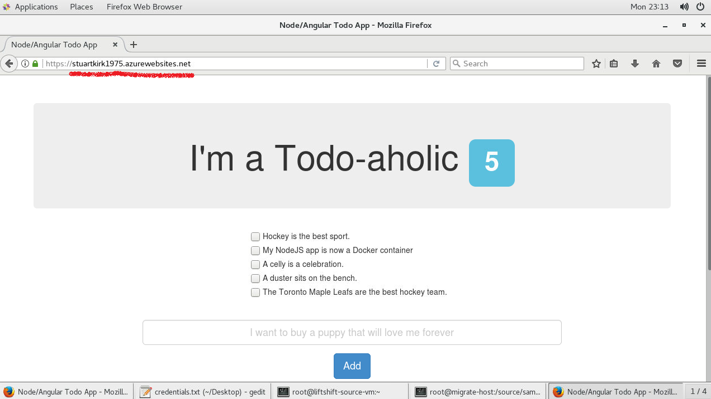

You have now modernized the workload which was being served from the migrate-host virtual machine. The virtual machine itself is no longer necessary.  If this had been a production environment, you would now be able to recoup the cost of the OS license, Human capital required to manage/patch the OS, Management server licenses, and the cost of hosting the virtual machine / hypervisor itself. 
